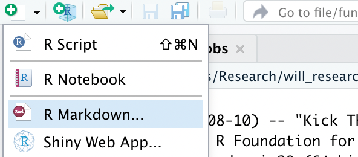
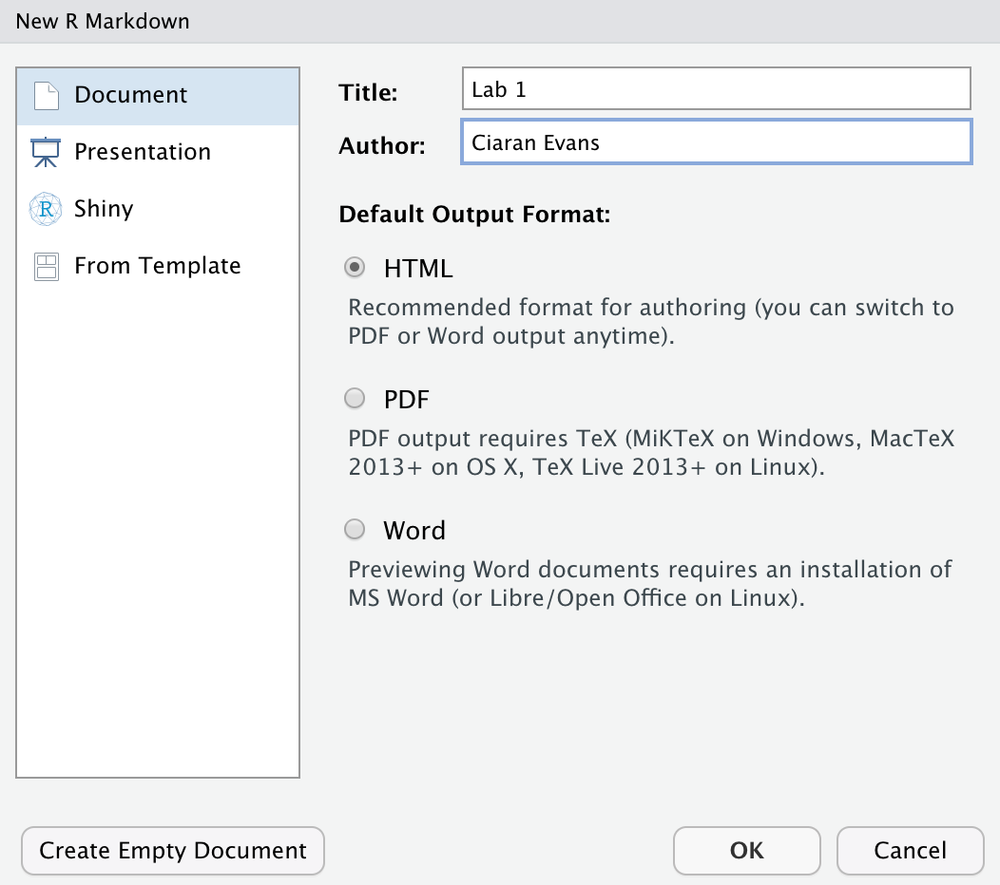
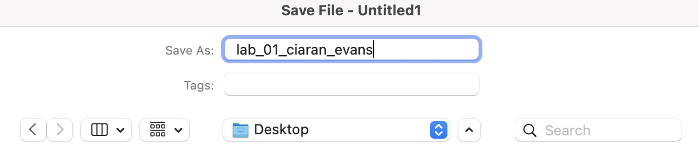

R Markdown is a super versatile tool, which can be used to build lecture slides, reports, and even web pages. `.Rmd` is the file extension for R Markdown documents.

R Markdown allows you to create data analysis documents which combine text, code, and figures.

Below are instructions to help you get started with R Markdown if you haven't used it before.

# Creating a new R Markdown file

**Step 1:** Click the *new file* button in the top left of R Studio 

**Step 2:** Select *R Markdown* from the drop-down menu that appears 

**Step 3:** Enter a desired title for the document in the window that appears (e.g., Lab 1)



**Step 4:** Save the `.Rmd` file somewhere easy to find, and give it a useful file name



**Step 5:** Now go back to your Lab 1 R Markdown document, and click the `knit` button  at the top of the document. This converts it to an HTML file that you can share. You can see that the knitted document contains plots and output.

# Components of an R Markdown document

### The YAML
At the very top the document, there is a section bordered by `---`. This is called the YAML, and it contains information about how to display our document. 

**Step 6:** In the YAML, change `author` from `Your Name` to your actual name (keep the quotes). For example,
```
author: "Ciaran Evans"
```
Now knit the document again; your name is now displayed at the top.

### Code chunks

R Markdown is great because we can include code directly in the document. This makes it *reproducible*, because the file contains all the code we used for a data analysis. We include R code in special blocks called *chunks*. These look like


There is also a chunk at the beginning that we call the *setup* chunk. This is where we will do things like import data and load packages.

**Step 7:** Click the `Run` button  on the right of the setup chunk. The `Run` button runs code so you can experiment with data before knitting the R Markdown document.

### Text

Text you write outside of code chunks is displayed normally in the knitted HTML document. The `##` is used to denote a *header*. For example, `## Exercise 1` is displayed as

after you knit. The number of `#` controls how big the header is (more `#` --> smaller).

